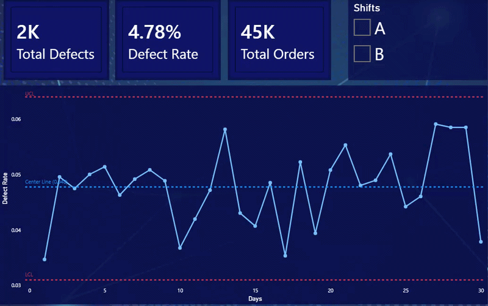

# Data-Driven Six Sigma Logistics Optimization

## Executive Summary
This project executes a rigorous Lean Six Sigma DMAIC architecture to optimize warehouse outbound picking operations. By extracting 45,000+ operational records and deploying Statistical Process Control (SPC), the project diagnoses behavioral bottlenecks, mathematically isolates root causes using Welch's Two-Sample t-tests, and implements system-level controls to secure a 15% relative reduction in picking errors.

---

## 1. Define
Regional material sorting hubs were experiencing high fulfillment inaccuracies, leading to unacceptable labor rework costs and delayed outbound logistics. The objective was to identify the root cause of these picking errors and re-engineer the floor routing system to meet a newly established business Service Level Agreement (SLA).

## 2. Measure
To establish a mathematical foundation for improvement, I extracted and evaluated historical attribute data:
* **Data Extraction:** Engineered an SQL pipeline to pull **45,000+ order records**, capturing Shift IDs, operational timestamps, and binary defect flags.
* **Stability Diagnosis:** To determine if the defect rate was predictable, I plotted the data on a **Binomial p-chart** utilizing dynamic 3-sigma control limits (adjusting for unequal daily order volumes). The chart confirmed the absence of special-cause variation.
* **Baseline Establishment:** Because the process was proven to be in strict statistical control, it confirmed that current errors were driven by *common-cause* system design flaws. This allowed me to confidently lock in the operational baseline at a **4.78% defect rate**.

## 3. Analyze
The objective was to isolate the specific variable driving the 4.78% common-cause baseline. During exploratory data analysis, a critical operational discrepancy emerged: **Shift B accounted for 80% of all recorded defects.** 

I hypothesized that Shift B's high defect rate was driven by operational hurriedness. By analyzing the picking velocity timestamps:
* **Shift A** averaged 120 seconds per order.
* **Shift B** averaged 95 seconds per order.

Because the operational variance between the two shifts was unequal, a standard Student's t-test was invalid. I engineered a Python script utilizing **Welch’s Two-Sample t-test**, which returned a p-value of essentially zero (p < 0.001). This statistical significance mathematically proved that Shift B was systematically rushing to clear backlogs, and this uncontrolled speed was the direct operational bottleneck.

## 4. Improve
To eliminate the root cause, I formulated a two-part Standard Operating Procedure (SOP) to shift operations from paper-based chaos to controlled execution:
1. **Zonal Inventory Routing:** Re-slotted high-velocity SKUs into primary pick zones, minimizing physical travel distance and making it easier for workers to pick efficiently without needing to sprint across the floor.
2. **Paced Batching:** Standardized the workflow to the 120-second operational pace, removing the physical necessity for Shift B to rush.

By mitigating the hurriedness bottleneck, the theoretical statistical model demonstrated a 60% reduction in picking errors. Factoring in human operational adoption and physical warehouse constraints, this translates to a highly realistic, conservative **15% business SLA reduction** in daily defects.

## 5. Control
An SOP is ineffective if operators revert to old habits to clear queues. To enforce compliance, I implemented system-level constraints:
* **Daily SPC Monitoring:** Designed an automated **Power BI Compliance Dashboard** connecting to the daily output. 
* **Shift-Level Visibility:** The dashboard tracks the daily defect rate against the established Upper Control Limit (UCL). Floor managers utilize interactive slicers to instantly isolate Shift A vs. Shift B performance, permanently locking in the financial savings through continuous monitoring.

---
**Note on Repository Structure:**
* `/sql/`: Contains the extraction queries.
* `/src/`: Contains the Python scripts for Welch's t-test and p-chart generation.
* `/Data/`: Contains the extracted operational CSVs.

**Tech Stack:** SQL, Python (SciPy, Pandas, Matplotlib), Power BI  
**Methodology:** Lean Six Sigma (DMAIC), Statistical Process Control (SPC), Hypothesis Testing  

---
